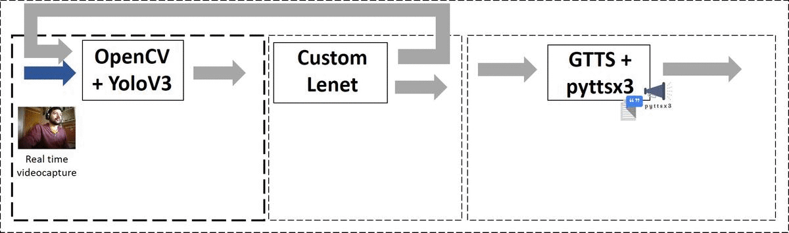

# Chilean Alphabet Sign Language Recognizer
Chilean Alphabet Sign Language Recognizer for letters perform by static gestures using OpenCV and ConvNets (YoloV3 and Custom Lenet) on Pytorch.



## Getting Started

### Prerequisites

  * python==3.8
  * pytorch==1.5.1
  * torchvision==0.6.1
  * opencv-python==4.2.0.32
  * numpy==1.18.5
  * pillow==7.2.0
  * scikit-learn==0.22.2
  * skimage==0.17.2
  * pyttsx3==2.90
  * gtts==2.1.1
  * numba==0.50.1
  * filterpy==1.4.5

### (Recommended) Installation using conda

* Install Miniconda3 for Python 3.8: https://docs.conda.io/en/latest/miniconda.html

* Add conda to path (depends on where you installed it)
```
source ~/miniconda3/etc/profile.d/conda.sh
```

* Create environment. Do I have a nice and shiny NVIDIA GPU?
  * YES
   ```
   conda env create -f environment_gpu.yml
   ```

  * NO
   ```
   conda env create -f environment_cpu.yml
   ```

### Download weights

1. Download ```yolov3_face_hand.weights``` file: https://tinyurl.com/3we23btn
2. Put ```yolov3_face_hand.weights``` file in ```weights/``` folder

## How to run
  
  * Activate environment
  ```
  conda activate lsch
  ```

  ### 1. If you want to use a web camera
  ```
  $ python alphabet_recognizer.py CAM_INDEX
  ```

  where ```CAM_INDEX``` = 0 or 1, it depends where the USB camera is connected.
  
  To check this, run:
  ```
  $ ls -ltrh /dev/video*
  ```

  ### 2. If you want to use a video
  ```
  $ python alphabet_recognizer.py VIDEO_PATH
  ```

  You can try the repo example video:
  ```
  $ python alphabet_recognizer.py testing_videos/ABC.mp4
  ```
  
  ### 3. (Recommended) GPU Usage

  If you have GPU, add ```-gpu``` flag at the end:

  ```
  $ python alphabet_recognizer.py CAM_INDEX -gpu
  ```
  or

  ```
  $ python alphabet_recognizer.py VIDEO_PATH -gpu
  ```

## Note
* If you are on a linux system and if the voice output is not working , then install ``` speak ``` ``` ffmpeg ``` and ``` libspeak1 ``` as shown below:
```
$ sudo apt install espeak ffmpeg libespeak1
```

## How to use
* Make a Alphabet Static Gesture of LSCh ([Click here to see the examples](https://i.imgur.com/dBhepde.png)), and wait for the letter to be added to the displayed spelled word on the **Word** window.
* If you want to add a letter that is represented by a dynamic gesture, just enter it using the keyboard (*G, J, Ñ, S, X* or *Z*).
* To save and play the audio of the spelled word, press Enter.
* Other keyboard actions:
  - *B*         : Delete all.
  - *Backspace* : Delete last letter.
  - *Space*     : Put a space at the end.
  - *Q*         : Close the application.

## Demo


## Authors

* Victor Vargas Sandoval victorvargassandoval93@gmail.com - *Instituto de Informática UACh*
* Victor Poblete - *Instituto de Acústica UACh*
* Pablo Huijse - *Instituto de Informática UACh*
* Yetzabeth González - *Instituto de Acústica UACh*

## References

* YOLOv3: Neural Networks for Object Detection - https://github.com/AlexeyAB/darknet
* Object Detection and Tracker with Pytorch - https://github.com/izolot/pytorch-yolo-objectdetecttrack
* LeNet5 Arquitecture Review- https://towardsdatascience.com/understanding-and-implementing-lenet-5-cnn-architecture-deep-learning-a2d531ebc342

## License

This project is licensed under the MIT License.

## Acknowledgments

We would like to thank all those who have made this project possible, especially UACh Inclusiva for giving us their full support and showing us the reality of deaf people in Chile.
